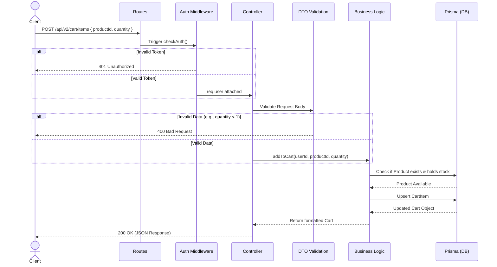

# Core Application Flow

This document details the precise lifecycle of an HTTP request within the application and explains the purpose of each architectural layer inside `backend/src/apps/*`.

## 1. Request Lifecycle Sequence

The platform adheres to a structured, layered pattern. The diagram below traces a typical authenticated request (e.g., adding an item to a cart) traversing through the backend layers.



## 2. Detailed Layer Breakdown

### Routes (`routes/`)

Registers paths and assigns middleware arrays.

```typescript
// Example: cart.routes.ts
router.post("/items", [authMiddleware, rateLimiter], CartController.addItem);
```

### Middleware (`middleware/`)

Protects endpoints organically before Controller execution.

- **Decoupled**: Should never know about the underlying business logic, only checking the perimeter (Headers, IPs, Tokens).

### Controllers (`controllers/`)

Controllers extract the HTTP context out of the equation.

- They parse `req.params`, `req.query`, and `req.body`.
- **Crucial Rule**: Controllers MUST NOT contain direct database queries. Their only job is mapping the HTTP request to the appropriate Service method and sending the HTTP response.

### DTOs & Validation (`dtos/`)

Using `class-validator`, these files act as gatekeepers against malformed data.

```typescript
// Example DTO
export class AddCartItemDto {
  @IsUUID()
  productId: string;

  @IsInt()
  @Min(1)
  quantity: number;
}
```

### Services (`services/`)

The heavy lifter where the domain logic exists.

- Handles transaction scopes.
- Communicates with external APIs (Emails, Clouds).
- Can be unit-tested effectively because it does not require an active Express request object.
