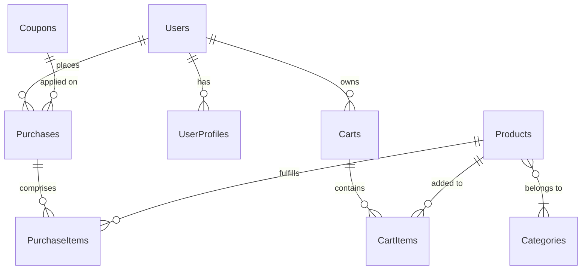

# Database & Data Access

The backend utilizes **Prisma** as the primary ORM for database interaction, focusing on PostgreSQL. It provides a strongly typed query builder that inherently prevents SQL injection and returns complete TypeScript objects.

## 1. Relational Entity Overview

The database structure is defined statically inside `backend/prisma/schema.prisma`.

Below is a simplified abstract **Entity-Relationship Diagram (ERD)** representing how the primary eCommerce entities are structured:



## 2. Shared Database Library (`libs/db`)

The database connection instance is globally managed within `backend/src/libs/db/db.ts`.

**Why?** If every service instantiated `new PrismaClient()`, Node would rapidly exhaust the PostgreSQL connection pool limits, causing the app to crash under load.

**Correct Usage Example:**

```typescript
// ✅ Good: Importing the global singleton instance
import { db } from "../../libs/db";

export const getProductById = async (id: string) => {
  return await db.products.findUnique({
    where: { id },
  });
};
```

## 3. Managing Migrations effectively

When adding new fields or modifying existing models in `schema.prisma`:

1.  **Draft your changes** in the schema file.
2.  **Generate a Migration File**:
    ```bash
    npx prisma migrate dev --name add_soft_delete_to_users
    ```
    _This creates a `.sql` file in the `prisma/migrations` directory representing the DDL (Data Definition Language) changes._
3.  **Deploying in Production**:
    DO NOT use `migrate dev`. Use:
    ```bash
    npx prisma migrate deploy
    ```

## 4. Query Optimization (N+1 Problem)

Prisma is vulnerable to the N+1 query problem if you fetch relations sequentially in open loops.

Instead of fetching an array of carts, and then mapping over them performing `db.cartItems.findMany()` inside the loop, **always use the explicitly provided `include` parameter:**

```typescript
// 🚀 Optimized Relation Fetching
const cartWithItems = await db.carts.findUnique({
  where: { id: cartId },
  include: {
    cart_items: {
      include: {
        product: true, // Fetches the cart, the items, and the product metadata in one go
      },
    },
  },
});
```
