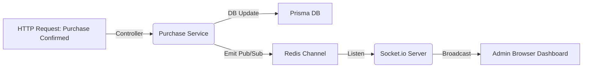

# Shared Libraries & Integrations (`libs/`)

To prevent logical duplication, shared utilities are housed within the `backend/src/libs/` directory.

## 1. Global Error Handling (`libs/errors`)

Instead of rewriting exact status code returns inside every single controller, the global error system leverages Express's `next(error)` mechanism.

**Creating predictable responses:**

```typescript
import { ApiError } from "../../libs/errors";

// Inside a service
if (!productFound) {
  // Automatically trapped by the global Express error boundary
  throw new ApiError(404, "The requested product does not exist.");
}
```

## 2. Real-Time WebSockets (`libs/socket`)

Socket logic is cleanly decoupled. Instead of placing socket instances inside regular HTTP routes, we use event emitters linked to Redis.



## 3. Redis Caching (`libs/redis`)

For endpoints bombarded by non-volatile requests (like fetching the storefront configuration or general product categories), the Redis library acts as a buffer.

**Basic implementation paradigm:**

```typescript
import { redisClient } from "../../libs/redis/client";

export const getCategories = async () => {
  // 1. Check cache
  const cached = await redisClient.get("categories_list");
  if (cached) return JSON.parse(cached);

  // 2. Fetch from DB if cache miss
  const categories = await db.categories.findMany();

  // 3. Populate Cache (e.g., set for 1 hour)
  await redisClient.setex("categories_list", 3600, JSON.stringify(categories));

  return categories;
};
```

_Note: Any Admin dashboard mutations to generic categories must implicitly invalidate (`redisClient.del()`) the impacted cache keys._
