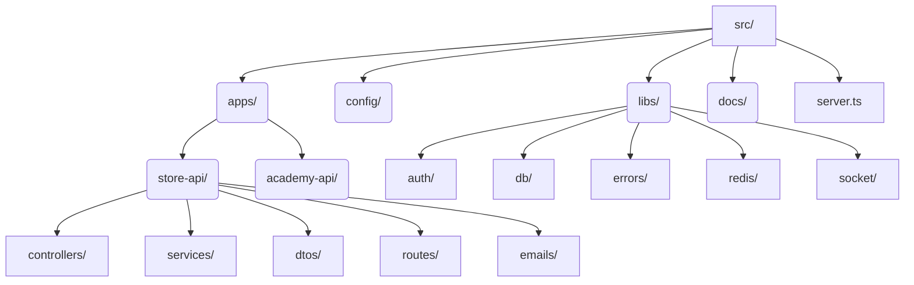

# Backend System Architecture & Overview

This document provides an in-depth look into the `backend/src` structure, showcasing how the different modular components interact with each other and the outside world.

## 1. High-Level Design & Component Interaction

The backend is built as a monolithic modular service written in TypeScript using **Express.js**. It defines clear domain boundaries, specifically separating concerns between the eCommerce face (`store-api`) and educational features (`academy-api`).

Below is a **System Architecture Diagram** illustrating the macro-level request flow and infrastructure dependencies:

### Core Architecture Principles:

- **Separation of Concerns**: HTTP parsing (Controllers) is strictly separated from business operations (Services).
- **Single Source of Truth**: The global data access layer (`libs/db`) ensures only one connection pool exists.
- **Event-Driven Enhancements**: Certain interactions (like purchase confirmations) emit Redis Pub/Sub events that the `Socket.io` server listens to for real-time admin dashboard updates.

## 2. Comprehensive Technology Stack

- **Runtime**: Node.js
- **Framework**: Express.js
- **Language**: TypeScript (Ensures compile-time type safety preventing runtime null references)
- **Database ORM**: Prisma (Primary DB for relational data & migrations) & Mongoose (for any isolated MongoDB metrics/usage)
- **Caching & Optimization**: Redis (via `ioredis` library) for rapid temporary data access, session state, and messaging.
- **Real-time Communication**: Socket.io (Facilitating bidirectional events between the backend and browser clients).
- **Media Management**: Cloudinary coupled with Multer for handling seamless multipart-form data image uploads and transformation.
- **Security & Auth**: Custom JWT implementations, `bcrypt` for password hashing, and Firebase Admin for generic cross-platform verifications.
- **Communications**: Nodemailer / Resend for transactional email dispatching.

## 3. Deep Dive into Directory Structure (`backend/src/`)

The `src/` directory represents the root of the application logic.

- **`apps/`**: The bounded contexts of the platform.
  - **`store-api/`**: The core driver for the eCommerce side. Contains domain entities like `Products`, `Categories`, `Carts`, `Coupons`, `Purchases`, and `Admin Dashboards`. Its logic is completely self-contained.
  - **`academy-api/`**: Reserved for specialized educational operations, isolated to prevent logical bleed into the store.
- **`config/`**: Static or environment-bound configuration logic (e.g., highly specific cross-origin (`CORS`) settings defining which domains are permitted to talk to the backend).
- **`libs/`**: The backbone of the backend. Contains generic, highly reusable code that `apps/` depend upon to function (e.g., connecting to the DB, throwing standardized errors, parsing JWTs).
- **`server.ts`**: The genesis file. It boots up Express, applies global JSON and URL-encoded body parsers, registers CORS, mounts `/api/v2/` routes, attaches the WebSocket server, and finally binds to the designated machine `PORT`.
